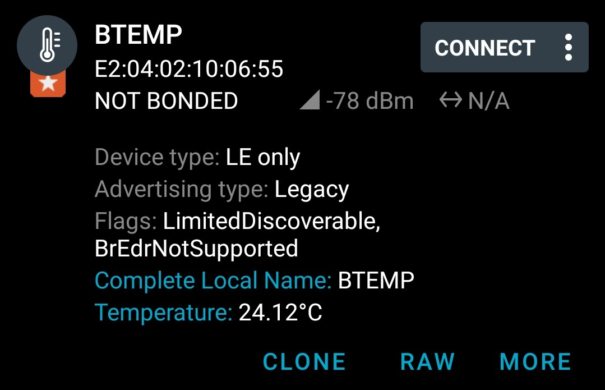
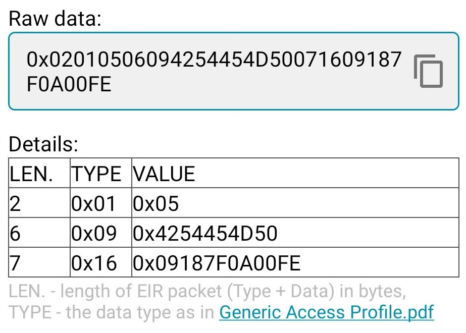
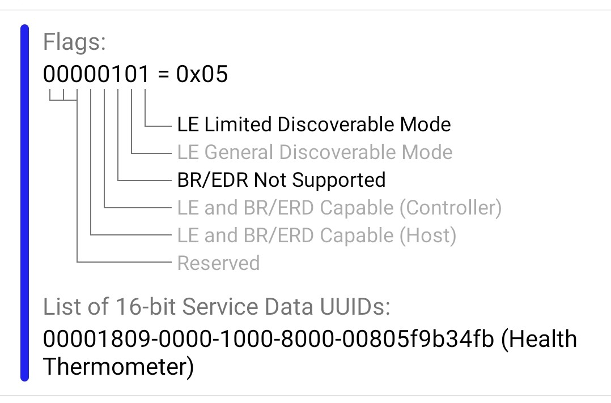

# Bluetooth with Arduino

Sending temperature measurement over Bluetooth Low Energy advertisement requires:
- an Arduino and a nRF24L01 radio module (or a RF-Nano that includes both)
- a DS12B20 digital thermometer
- and a few lines of code based on BTLE and RF24 library,

```
OneWire oneWire(ONE_WIRE_BUS);
DallasTemperature sensors(&oneWire);

RF24 radio(CEPIN, CSPIN);
BTLE btle(&radio);

void setup() {
  // start temperature sensor and Bluetooth
  sensors.begin();
  btle.begin("BTEMP");
}

void loop() {
  float temp = sensors.getTempCByIndex(0);

  nrf_service_data buf;
  buf.service_uuid = NRF_TEMPERATURE_SERVICE_UUID;  // 0x1809
  buf.value = BTLE::to_nRF_Float(temp);
  btle.advertise(0x16, &buf, sizeof(buf));
  btle.hopChannel();

  delay(1000);
}
```


# Bluetooth with nRF Connect under Android 

nRF Connect by Nordic Semiconductor can receive and display the temperature send by the Arduino.

 


Asking for details, nRF Connect can show the bytes received over the radio  `02010506094254454D50071609187F0A00FE` explain how they were decoded.

 

The packet was made of three sections, each made up of: one byte for the lenght of the section, one byte for the type of the section, and a variable number of bytes for the data.

- fist section `020105`, of length `02` is of type `01`, "Flags" as per [Generic Access Profile (page 1)](https://btprodspecificationrefs.blob.core.windows.net/assigned-numbers/Assigned%20Number%20Types/Generic%20Access%20Profile.pdf) and nRF Connect explains the meaning of each bite of the '05' value (below).
- second section `0x06094254454D50`, of length `06` is of type `09`, "Complete Local Name»" as per [Generic Access Profile (page 1)](https://btprodspecificationrefs.blob.core.windows.net/assigned-numbers/Assigned%20Number%20Types/Generic%20Access%20Profile.pdf) and its value `4254454D50`is the string "BTEMP" enocoded in ASCII.
- third section, `071609185A0A00FE`, of length `07` is of type `16`, "Service Data»" as per [Generic Access Profile (page 3)](https://btprodspecificationrefs.blob.core.windows.net/assigned-numbers/Assigned%20Number%20Types/Generic%20Access%20Profile.pdf) and its value `09185A0A00FE` is made of three parts: the first two bytes `0918` stand for "Health Thermometer" as per [16-bit UUID Numbers Document (page 28)](https://btprodspecificationrefs.blob.core.windows.net/assigned-values/16-bit%20UUID%20Numbers%20Document.pdf). The next two bytes are a bigendian signed int16 representing 100th of Celcius degrees (`6C09` is 2412 or 24.12°C, `7F0A` is 2687 or 26.87°C, etc) as described in [GATT Specification Supplement (section 3.204)](https://www.bluetooth.org/DocMan/handlers/DownloadDoc.ashx?doc_id=524815). The last two bytes `00FE` are ???.


 

# Bluetooth under Linux 


What is BlueZ?
BlueZ is the Bluetooth stack for Linux. It handles both Bluetooth BR/EDR as well as BLE. 

To communicate with BlueZ, we’ll be using something called D-Bus. 
To see what’s happening on the system bus, you can run 
`sudo dbus-monitor --system "destination='org.bluez'" "sender='org.bluez'`

Command line tool bluetoothctl comes bundled with BlueZ.

```
$ bluetoothctl
[NEW] Device E2:04:02:10:06:55 BTEMP

$ bluetoothctl info E2:04:02:10:06:55 
Device E2:04:02:10:06:55 (random)
	Name: BTEMP
	Alias: BTEMP
	Paired: no
	Trusted: no
	Blocked: no
	Connected: no
	LegacyPairing: no
	ServiceData Key: 00001809-0000-1000-8000-00805f9b34fb (Health Thermometer UID)
	ServiceData Value: b7 09 00 fe            
	RSSI: -29
```


Ref: + [Creating a ble peripheral with BlueZ](https://punchthrough.com/creating-a-ble-peripheral-with-bluez/)
