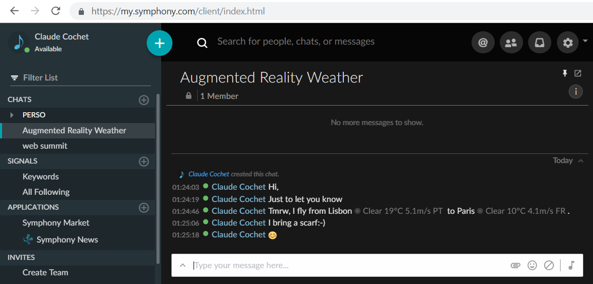
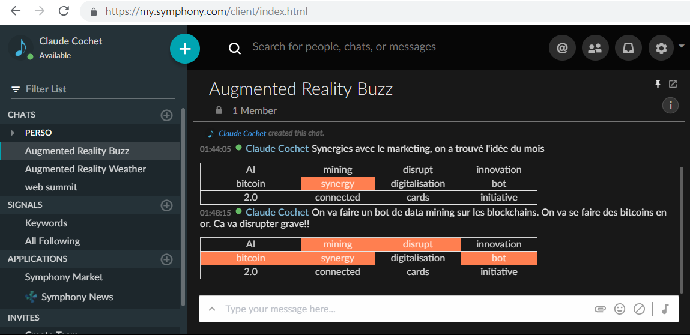

# Augmented Reality for Symphony 

Augmented incoming message: add extra insight to received messages. Only the recipient can see the extra information. HoloLens is coming to Symphony :-)

## Weather information overlay

## Buzz words overlay

## Install

1. Add Tampermonkey to you browser.
2. Add this script to Tampermonkey https://github.com/kljh/kljh.github.io/blob/master/misc/symphony/symphony-tamper.js

## License

[MIT License](LICENSE)  e.g. do whatever you want with it :-P

